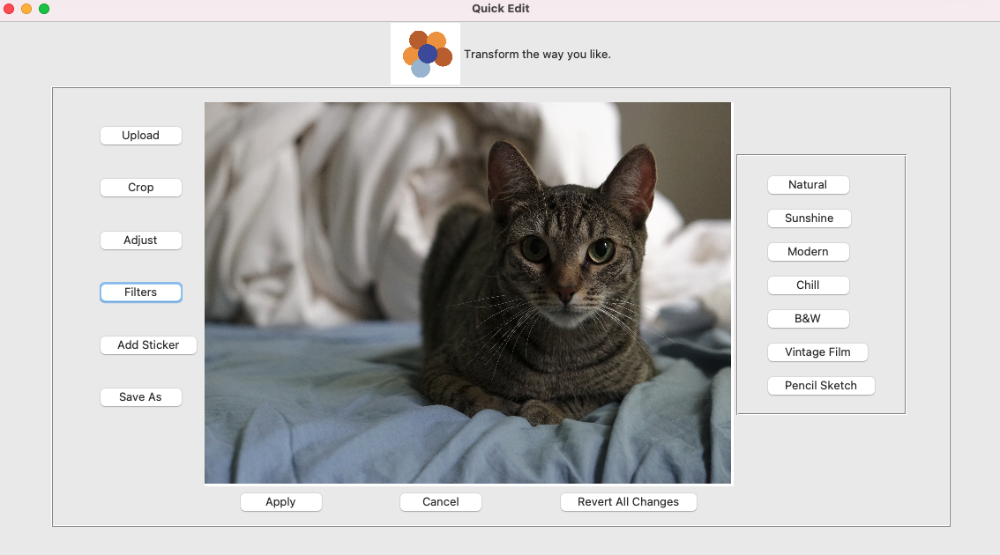

## Table of contents
* [General info](#general-info)
* [Technologies](#technologies)
* [Setup](#setup)
* [Author's Note](#note)

## General info
This project is a simple image editing application. It is not designed for photoshop experts, but for people who wants to quickly and easily improve their photo. The main functions include `Upload`, `Crop`, `Adjust`, `Filters`, `Add Sticker` and `Save`. The `Filters` part includes 'Nature', 'Sunshine', 'Modern', 'Chill', 'B&W', 'Vintage Film' and 'Pencil Sketch'. Instead of hard-to-understand words, I named the filters by feelings. All functions and options are designed based on my personal editing habit and preference.



## Technologies
Project is created with: Python, Tkinter, Numpy, OpenCV, PIL and cv2.

## Setup
To run this project, install it locally and run:

```
$ cd 'where you stored the file'
$ python main.py
```
## Author's Note

This is a python project including both frontend and backend. As a photographer, I'm excited to know how the editors actually work and willing to add more new features. Please let me know if you have any suggestions.
